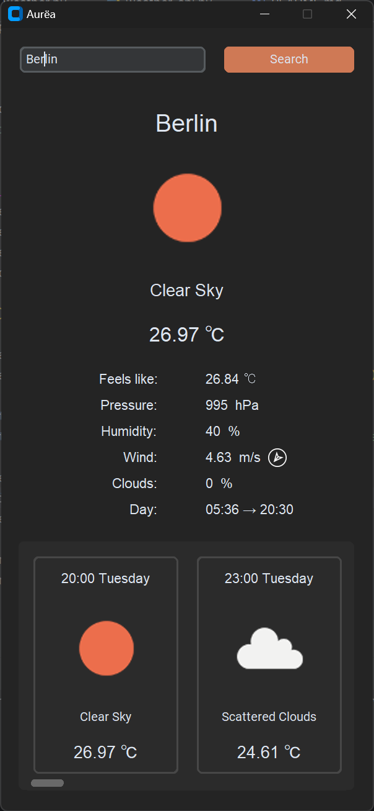
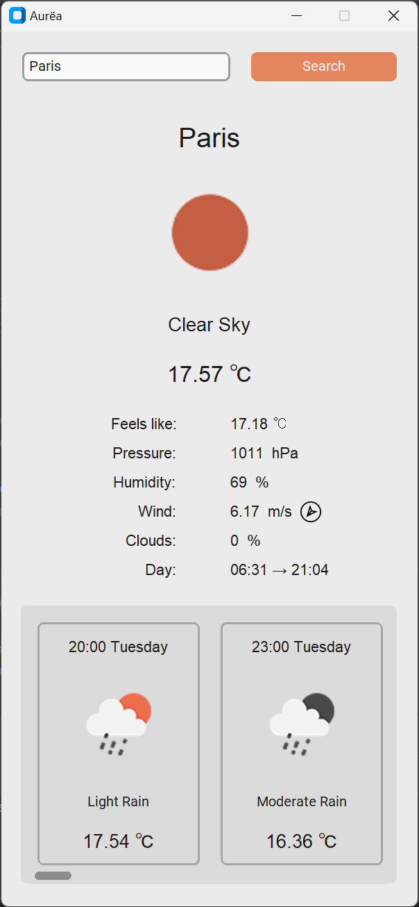

# Aurëa - Weather App
Weather app written in Python using OpenWeather API

| Dark Mode                           | Light Mode                            |
|-------------------------------------|---------------------------------------|
|  |  |


## Installation
```shell
git https://github.com/pgredys/Aurea.git
cd Aurea
pip install -r requirements.txt 
```

save your OpenWeather API key inside `src/.env` 

example:

`API_KEY="########"`

_register to OpenWeather to get KEY_
